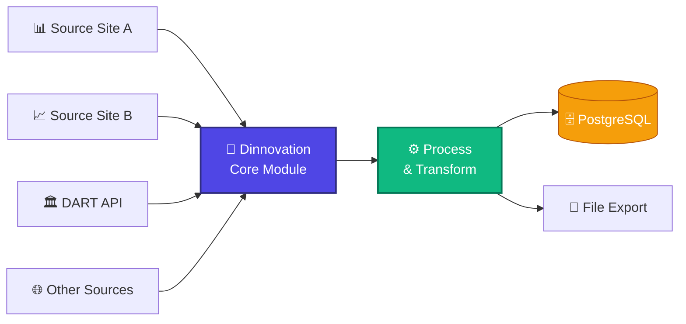
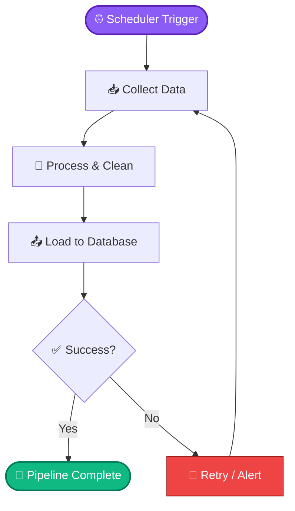
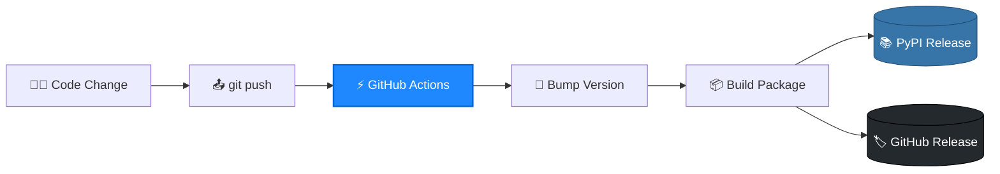

<div align="center">

# 🚀 Dinnovation

### Digital Industry Innovation Data Platform

**One unified pipeline for collecting, processing, and loading market data — at scale.**

[](https://pypi.python.org/pypi/dinnovation)
[](https://pypi.python.org/pypi/dinnovation)
[](https://pypi.python.org/pypi/dinnovation)
[](LICENSE)
[](https://github.com/cmblir/dinnovation/stargazers)

[**Quick Start**](#-quick-start) • [**Features**](#-why-dinnovation) • [**Architecture**](#-architecture) • [**Docs**](./quick_start/README.md) • [**Contributing**](#-contributing)

</div>

---

## 🤔 The Problem

Building data pipelines from scratch is painful. You write a crawler for every site, bolt on a scheduler, then handle DB loading — and end up spending more than half your time on infrastructure instead of insights.

## 💡 The Solution

**Dinnovation unifies the entire collect → process → load workflow behind a single API.** Originally built to power a Big Data Center's daily operations, it ships with a built-in scheduler and a GitHub Actions release pipeline out of the box.

---

## ✨ Why Dinnovation?

<table>
<tr>
<td width="25%" align="center"><b>🌐 Multi-Source</b></td>
<td width="25%" align="center"><b>⚡ Auto Pipeline</b></td>
<td width="25%" align="center"><b>📦 Plug & Play</b></td>
<td width="25%" align="center"><b>🔄 CI/CD Ready</b></td>
</tr>
<tr>
<td>Pull from multiple financial and corporate data sites through one consistent interface</td>
<td>Schedule end-to-end ETL jobs without cron or external orchestrators</td>
<td>One <code>pip install</code> and you're shipping data straight to your warehouse</td>
<td>Push code → bump version → publish to PyPI & GitHub Releases automatically</td>
</tr>
</table>

---

## 📦 Installation

```bash
pip install dinnovation
```

<details>
<summary><b>Install from source</b></summary>

```bash
git clone https://github.com/cmblir/dinnovation.git
cd dinnovation
pip install -r requirements.txt
# or
python setup.py install
```
</details>

<details>
<summary><b>📋 Full dependency list</b></summary>

| Library | Version |
|---|---|
| pandas | 1.5.3 |
| numpy | 1.24.2 |
| tqdm | 4.64.1 |
| OpenDartReader | 0.2.1 |
| beautifulsoup4 | 4.11.2 |
| urllib3 | 1.26.14 |
| selenium | 4.8.2 |
| webdriver_manager | 3.8.5 |
| chromedriver_autoinstaller | 0.4.0 |
| psycopg2 | 2.9.5 |
| sqlalchemy | 2.0.4 |
| cryptography | 41.0.3 |

**Required:** `Python >= 3.9`

</details>

---

## 🚀 Quick Start

```python
from dinnovation import DataCollector

# Collect → process → load, in one chain
collector = DataCollector(source="dart")
collector.collect().process().load(db="postgres")
```

Read the full walkthrough in the [**Quick Start Guide →**](./quick_start/README.md)

---

## 🏗 Architecture

A single core module ingests from multiple sources, runs them through a processing layer, and emits to your database or files — no need to glue separate libraries together.



---

## 🔁 Auto Process

The built-in scheduler runs the entire ETL cycle for you — including retries and alerts on failure.



---

## ⚙️ Workflow

A single `git push` triggers version bump → package build → PyPI publish → GitHub Release.



---

## 📚 Documentation

| Resource | Description |
|---|---|
| 📖 [**Quick Start**](./quick_start/README.md) | Get your first pipeline running in 5 minutes |
| 🧪 **Examples** | See the `/examples` directory |
| 🛠 **API Reference** | *Coming soon* |

---

## 🗺 Roadmap

- [x] DART and major financial-site connectors
- [x] PostgreSQL loading support
- [x] Automated GitHub Actions release workflow
- [ ] BigQuery / Snowflake loading support
- [ ] CLI tool (`dinnovation run <pipeline>`)
- [ ] Web dashboard for monitoring

---

## 🤝 Contributing

Contributions are welcome — bug fixes, new data-source connectors, docs improvements, all of it.

```bash
# 1. Fork & clone
# 2. Create a feature branch
git checkout -b feature/amazing-feature

# 3. Commit your changes
git commit -m "feat: add amazing feature"

# 4. Push and open a PR
git push origin feature/amazing-feature
```

---

## ⚖️ License & Disclaimer

Released under the [**Apache 2.0 License**](LICENSE).

> ⚠️ **Important Legal Disclaimer**
>
> Dinnovation is **not affiliated with, endorsed by, or vetted by** any source sites. Use at your own risk and discretion. For information about your rights to use the actual data downloaded, refer to the **Terms of Use of each respective site**. Dinnovation is intended for **personal use only**.

---

<div align="center">

### ⭐ If Dinnovation saves you time, please consider giving it a star!

Made with ❤️ by [**@cmblir**](https://github.com/cmblir)

</div>
